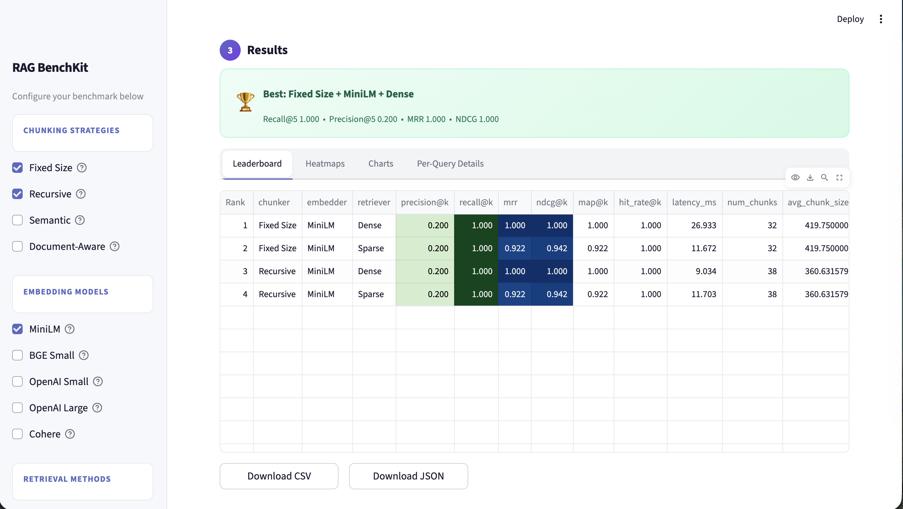

# RAG-OPS

<p align="center">
  <strong>Find the best chunking, embedding, and retrieval strategy for your RAG pipeline — in minutes, not days.</strong>
</p>

<p align="center">
  
  
  
  
</p>


---

RAG-OPS is an open-source evaluation toolkit that benchmarks every combination of chunking strategies, embedding models, and retrieval methods against your documents — and visualizes the results in a clean dashboard. No boilerplate, no notebooks, no guesswork.

> Most RAG teams pick chunking and embedding settings once and never revisit them. This tool makes it trivial to find out if that was the right call.

---

## What it does

You give it documents and queries with ground-truth labels. It runs every combination you configure and tells you which one wins — with Recall@K, Precision@K, MRR, NDCG, MAP, and Hit Rate.

```
Fixed Size  ─┐
Recursive   ─┤  × MiniLM ─┐          ┌─ Dense (FAISS)
Semantic    ─┤    BGE    ─┤  → eval  ─┤  Sparse (BM25)
Doc-Aware  ─┘  OpenAI  ─┘          └─ Hybrid (RRF)
              Cohere
```

---

## Features

| | |
|---|---|
| **4 Chunking Strategies** | Fixed Size, Recursive, Semantic (sentence similarity), Document-Aware (markdown/code) |
| **5 Embedding Models** | MiniLM, BGE Small (local/free), OpenAI Small, OpenAI Large, Cohere |
| **3 Retrieval Methods** | Dense (FAISS cosine), Sparse (BM25), Hybrid (Reciprocal Rank Fusion) |
| **6 IR Metrics** | Precision@K, Recall@K, MRR, NDCG@K, MAP@K, Hit Rate@K |
| **Visual Dashboard** | Leaderboard, heatmaps, ranked charts, per-query drill-down |
| **Sample Data** | 10 Python tutorial docs + 15 queries — run a demo in 30 seconds |
| **Export** | Download results as CSV or JSON |
| **Operational Features** | Disk cache, saved run artifacts, CLI entrypoint, Dockerfile, CI workflow |

---

## Quick Start

### 1. Clone the repo

```bash
git clone https://github.com/sausi-7/rag-ops.git
cd rag-ops
```

### 2. Create and activate a virtual environment

```bash
# Create venv
python3 -m venv .venv

# Activate — macOS/Linux
source .venv/bin/activate

# Activate — Windows (PowerShell)
.venv\Scripts\Activate.ps1
```

### 3. Install dependencies

For running the app:

```bash
pip install .
```

For development (includes pytest, ruff):

```bash
pip install -e ".[dev]"
```

### 4. Run the app

```bash
streamlit run app.py
```

Then open the browser, click **Load Sample Data**, select your strategies, and hit **Run Benchmark**.

**Requirements:** Python 3.9+. Local embeddings (MiniLM, BGE) run on CPU — no GPU needed. API keys for OpenAI/Cohere are entered in the sidebar.

### 5. Run from the CLI

```bash
rag-ops --sample
```

Or run against local files:

```bash
rag-ops \
  --docs-dir ./my_docs \
  --queries-file ./queries.json \
  --chunkers "Fixed Size" Recursive \
  --embedders MiniLM \
  --retrievers Dense Sparse
```

By default, cached chunks and embeddings are stored in `.rag_ops_cache/`, and saved run artifacts are written to `.rag_ops_runs/`.

### 6. Run the service foundation

RAG-OPS now also includes a service-platform foundation for the upcoming API-first architecture:

```bash
rag-ops-api
```

and a worker scaffold:

```bash
rag-ops-worker
```

For local multi-service development:

```bash
docker compose up --build
```

The platform stack expects a local `.env` file for infrastructure credentials such as Postgres and MinIO.

---

## Using your own data

**Documents** — upload `.txt` or `.md` files. Each file = one document. The filename (without extension) becomes the `doc_id`.

**Queries** — upload a JSON file:

```json
[
  {
    "query_id": "q01",
    "query": "How does Python handle memory management?",
    "relevant_doc_ids": ["doc_01_python_basics"]
  }
]
```

`relevant_doc_ids` must match document filenames (without extension). These are your ground-truth labels — the tool measures how well each pipeline retrieves them.

---

## Dashboard tabs



| Tab | What it shows |
|-----|---------------|
| **Leaderboard** | All combinations ranked by Recall@K with color-coded metric columns |
| **Heatmaps** | Chunker × Embedder performance matrix, one heatmap per retrieval method |
| **Charts** | Ranked bar chart of all configs, multi-metric comparison, radar profile of best config |
| **Per-Query Details** | Hit/miss breakdown for each query on a selected configuration |

---

## Project structure

```
rag-ops/
├── app.py                          # Thin Streamlit entrypoint
├── docker-compose.yml              # Local multi-service platform topology
├── pyproject.toml                  # Package config, scripts, and test settings
├── Dockerfile                      # Containerized runtime
├── src/rag_ops/
│   ├── api/                        # FastAPI application and middleware
│   ├── cli.py                      # CLI benchmark entrypoint
│   ├── data_loading.py             # Sample, uploaded, and local file loading
│   ├── db/                         # SQLAlchemy engine and persistence helpers
│   ├── models.py                   # Typed dataclasses
│   ├── observability.py            # Request IDs and structured logging
│   ├── redis_client.py             # Thin Redis wrapper
│   ├── cache.py                    # Disk caching helpers
│   ├── experiment_store.py         # Saved run artifacts
│   ├── chunkers.py                 # 4 chunking strategies
│   ├── embedders.py                # 5 embedding models
│   ├── retrievers.py               # 3 retrieval methods
│   ├── metrics.py                  # 6 evaluation metrics
│   ├── runner.py                   # Benchmark orchestration
│   ├── services/                   # Platform service helpers
│   ├── validation.py               # Input and config validation
│   ├── ui/                         # Streamlit UI modules
│   ├── workers/                    # Async worker entrypoints
│   │   ├── app.py                  # Main UI orchestration
│   │   ├── sidebar.py              # Sidebar config controls
│   │   ├── data_views.py           # Data loading and preview
│   │   ├── results.py              # Result rendering
│   │   └── styles.py               # Shared page styling
│   └── sample_data/                # Built-in demo corpus
│       ├── corpus/                 # 10 .txt documents
│       └── queries.json            # 15 queries with ground truth
├── tests/                          # Pytest test suite
└── .github/workflows/ci.yml        # CI pipeline
```

For architecture details, implementation notes, and how to extend the system, see [README_TECHNICAL.md](README_TECHNICAL.md).

---

## Running tests

```bash
# Make sure dev dependencies are installed
pip install -e ".[dev]"

pytest tests/
```

---

## Contributing

We welcome contributions — new chunkers, embedders, retrieval methods, metrics, UI improvements, and more. See [CONTRIBUTING.md](CONTRIBUTING.md) to get started.

---

## License

MIT — use it, fork it, build on it.
