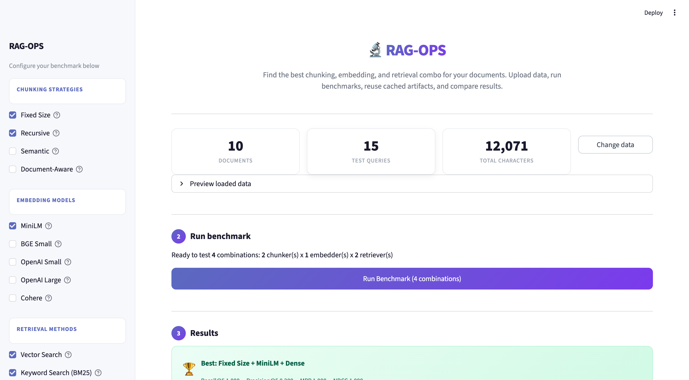

# RAG-OPS

<p align="center">
  <strong>Find the best chunking, embedding, and retrieval strategy for your RAG pipeline — in minutes, not days.</strong>
</p>

<p align="center">
  
  
  
  
  
</p>



---

RAG-OPS is an open-source retrieval evaluation platform for RAG teams. It benchmarks every combination of chunking strategies, embedding models, and retrieval methods against your documents, then shows the winner in a Streamlit-first admin UI with persisted runs, history, and reporting.

> Most RAG teams pick chunking and embedding settings once and never revisit them. RAG-OPS makes that decision measurable.

---

## What it does

You give it documents and queries with ground-truth labels. It runs every combination you configure and tells you which one wins with Recall@K, Precision@K, MRR, NDCG, MAP, and Hit Rate.

```text
Fixed Size  ─┐
Recursive   ─┤  × MiniLM ─┐          ┌─ Dense (FAISS)
Semantic    ─┤    BGE    ─┤  → eval  ─┤  Sparse (BM25)
Doc-Aware  ─┘  OpenAI  ─┘          └─ Hybrid (RRF)
              Cohere
```

---

## Features

| | |
|---|---|
| **4 Chunking Strategies** | Fixed Size, Recursive, Semantic, Document-Aware |
| **5 Embedding Models** | MiniLM, BGE Small, OpenAI Small, OpenAI Large, Cohere |
| **3 Retrieval Methods** | Dense, Sparse, Hybrid |
| **6 IR Metrics** | Precision@K, Recall@K, MRR, NDCG@K, MAP@K, Hit Rate@K |
| **Streamlit Admin UI** | Guided load → configure → run → results workflow |
| **API + Worker Foundation** | FastAPI service, async worker, persisted runs, comparison APIs |
| **Saved History** | Run artifacts, per-query drill-down, workspace leaderboard |
| **Operational Features** | Disk cache, object-store artifact path, Docker Compose, Prometheus/Grafana |

---

## Architecture At A Glance

RAG-OPS is no longer just a single Streamlit script. The current repo is organized around a Streamlit-first product surface backed by a service platform:

- `Streamlit admin UI` for dataset loading, benchmark setup, results, credentials, and historical reports
- `FastAPI API` for datasets, configs, runs, credentials, and reporting
- `worker` for async benchmark execution
- `Postgres` for persisted metadata
- `Redis` for queue/run-state coordination
- `object storage` for artifact persistence

You can still run the Streamlit UI locally by itself, but the production-shaped path is the multi-service stack.

---

## Quick Start

### 1. Clone the repo

```bash
git clone https://github.com/sujal7103/RAG-OPS.git
cd RAG-OPS
```

### 2. Create and activate a virtual environment

```bash
python3 -m venv .venv
source .venv/bin/activate
```

### 3. Install dependencies

For normal usage:

```bash
pip install .
```

For development:

```bash
pip install -e ".[dev]"
```

### 4. Run the Streamlit UI

```bash
streamlit run app.py
```

Then open the browser, load sample data, choose your strategies, and run the benchmark.

**Requirements:** Python 3.9+. Local embeddings run on CPU. OpenAI and Cohere models require provider credentials or API keys depending on mode.

### 5. Run against the API service

To keep Streamlit as the UI while using the service layer underneath:

```bash
RAG_OPS_API_BASE_URL=http://localhost:8000 streamlit run app.py
```

In API-backed mode, datasets, configs, runs, artifacts, and reports flow through the FastAPI service instead of only local in-process execution.

### 6. Run from the CLI

```bash
rag-ops --sample
```

Or against local files:

```bash
rag-ops \
  --docs-dir ./my_docs \
  --queries-file ./queries.json \
  --chunkers "Fixed Size" Recursive \
  --embedders MiniLM \
  --retrievers Dense Sparse
```

### 7. Run the service foundation

Start the API:

```bash
rag-ops-api
```

Start the worker in another terminal:

```bash
rag-ops-worker
```

Or bring up the local multi-service stack:

```bash
docker compose up --build
```

For containerized staging or production guidance, see [DEPLOYMENT.md](DEPLOYMENT.md).

---

## Using Your Own Data

**Documents**: upload `.txt` or `.md` files. Each file becomes one document and the filename without extension becomes the `doc_id`.

**Queries**: upload a JSON file like this:

```json
[
  {
    "query_id": "q01",
    "query": "How does Python handle memory management?",
    "relevant_doc_ids": ["doc_01_python_basics"]
  }
]
```

`relevant_doc_ids` must match your document filenames without extension. These labels are the ground truth used during evaluation.

---

## Streamlit Workflow

The current primary UI is still Streamlit-first:

1. Load sample data or upload your own corpus
2. Configure chunkers, embedders, retrievers, and `top_k` from the sidebar
3. Run the benchmark locally or through the API-backed worker path
4. Inspect leaderboard, heatmaps, charts, per-query details, and historical reports

The Streamlit UI also supports API-backed credential management and workspace reporting when `RAG_OPS_API_BASE_URL` is configured.

---

## Project Structure

```text
RAG-OPS/
├── app.py                          # Thin Streamlit entrypoint
├── alembic/                        # Database migrations
├── docker-compose.yml              # Local multi-service topology
├── Dockerfile                      # Python application image
├── monitoring/                     # Prometheus and Grafana config
├── pyproject.toml                  # Package metadata and CLI scripts
├── src/rag_ops/
│   ├── api/                        # FastAPI app, routes, dependencies, middleware
│   ├── cache.py                    # Disk cache helpers
│   ├── chunkers.py                 # Retrieval chunking strategies
│   ├── cli.py                      # CLI benchmark entrypoint
│   ├── data_loading.py             # Sample and uploaded data handling
│   ├── db/                         # SQLAlchemy models, session, bootstrap
│   ├── embedders.py                # Embedding model integrations
│   ├── experiment_store.py         # Run artifact persistence helpers
│   ├── metrics.py                  # Retrieval evaluation metrics
│   ├── object_store.py             # S3-compatible artifact storage
│   ├── observability.py            # Logging and request context
│   ├── redis_client.py             # Redis helper layer
│   ├── repositories/               # Persistence repositories
│   ├── results_frame.py            # Result-frame helpers
│   ├── retrievers.py               # Retrieval implementations
│   ├── runner.py                   # Benchmark orchestration
│   ├── security/                   # Auth and credential encryption
│   ├── services/                   # Run execution, runtime, health services
│   ├── settings.py                 # App and service settings
│   ├── ui/                         # Streamlit UI modules
│   ├── validation.py               # Input/config validation
│   └── workers/                    # Async worker entrypoints
├── tests/                          # Pytest suite
└── screenshots/                    # README images
```

For implementation details and extension guidance, see [README_TECHNICAL.md](README_TECHNICAL.md).

---

## Testing

```bash
pip install -e ".[dev]"
pytest -q
python3 -m compileall app.py src tests alembic monitoring
```

---

## Deployment Note

The current production-shaped deployment target is a full multi-service host, not Vercel. RAG-OPS relies on a long-running Streamlit UI, API service, async worker, and supporting stateful infrastructure such as Postgres, Redis, and object storage.

If you want to deploy the current stack, use Docker-based hosting such as Render, Railway, Fly, a VPS, or another platform that supports long-running Python services.

---

## Contributing

Contributions are welcome across retrieval logic, evaluation, docs, tests, operations, and UI polish. See [CONTRIBUTING.md](CONTRIBUTING.md).

---

## License

MIT — use it, fork it, build on it.
